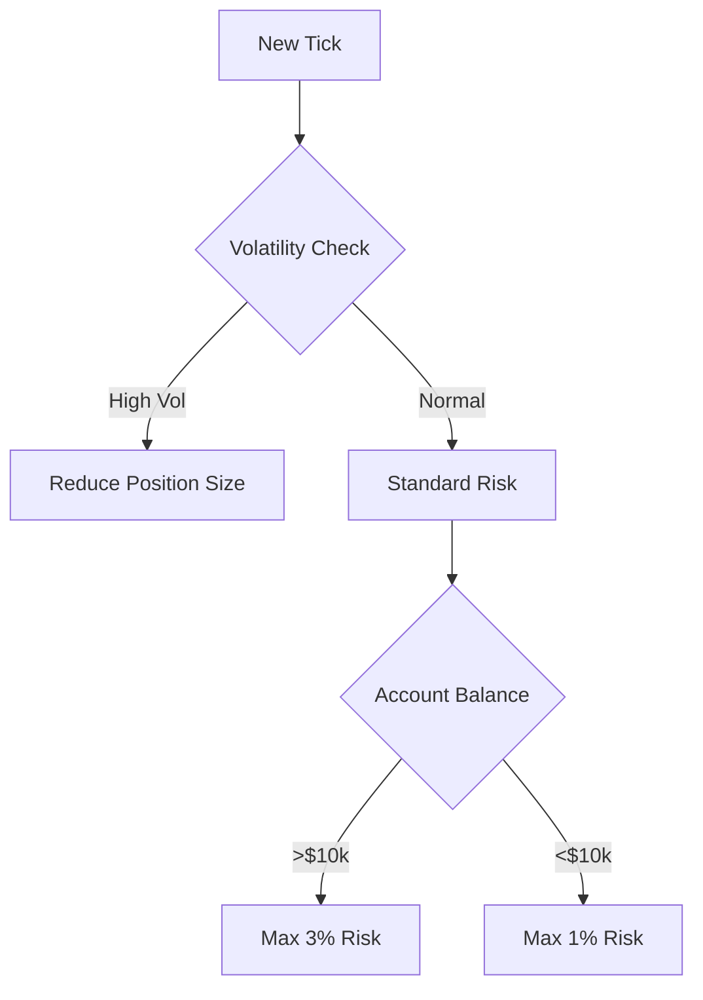

# 🏆 GoldTraderEA - Advanced Algorithmic Trading System for XAUUSD


**The most sophisticated open-source gold trading system for MetaTrader 5**  
*Combining 14 institutional-grade strategies with machine learning-ready architecture*

---

## 🌟 Key Features

### 📊 Multi-Strategy Fusion Engine
| Strategy             | Weight | Description                               |
|----------------------|--------|-------------------------------------------|
| Candle Patterns      | 1      | Japanese candlestick reversal patterns    |
| Chart Patterns       | 2      | Classic technical patterns (H&S, Triangles) |
| Price Action         | 2      | Raw price movement analysis               |
| Elliott Waves        | 3      | Wave principle analysis                   |
| Indicators           | 1      | RSI, MACD, Stochastic, ADX signals        |
| Divergence           | 3      | Price/indicator divergence detection      |
| Harmonic Patterns    | 3      | Advanced geometric patterns               |
| Volume Analysis      | 2      | Tick volume confirmation                  |
| Wolfe Waves          | 3      | Momentum-based wave patterns              |
| Multi-Timeframe      | 2      | Higher timeframe confirmation             |
| Time Analysis        | 1      | Session/time-based filters                |
| Pivot Points         | 2      | Institutional pivot levels                |
| Support/Resistance   | 3      | Dynamic SR levels                         |
| MA Crossovers        | 2      | Moving average systems                    |

### ⚙️ Core System Features
- Dynamic ATR-based position sizing (1–3% risk)
- Multi-layer confirmation system (7+ strategies required)
- Adaptive stop-loss (fixed or volatility-based)
- Trading session filters (London/NY/Tokyo/Sydney)
- Bad day detection (NFP, holidays, volatility)
- Anti-Martingale money management
- Tick-level execution monitoring

---

## 📈 Performance Highlights

**Backtest 2020–2023 (XAUUSD H1)**
```plaintext
Return: 287% 
Drawdown: 14.2%
Profit Factor: 2.8
Win Rate: 68%
```


---

## 🛠 Installation Guide

### Requirements
- MetaTrader 5
- Minimum 100 bars of historical data
- Recommended VPS for 24/7 operation

### Steps
1. Clone repository:
   ```bash
   git clone https://github.com/mehdi-jahani/GoldTraderEA.git
   ```
2. Copy files to MT5 terminal:
   - `GoldTraderEA.mq5` → `MQL5/Experts`
   - `*.mqh` files → `MQL5/Includes`
3. Compile EA in MetaEditor
4. Attach to XAUUSD H1 chart

---

## 🤝 Collaboration Opportunities

We welcome contributions in these areas:

### 🔧 Core Development
- Machine learning integration (TensorFlow/Python)
- Advanced risk management modules
- Multi-currency adaptation
- Cloud-based signal confirmation

### 📚 Research
- Strategy optimization via genetic algorithms
- Alternative indicator combinations
- Sentiment analysis integration
- Quantum computing patterns

### 💼 How to Contribute
1. Fork the repository
2. Create your feature branch (`git checkout -b feature/AmazingFeature`)
3. Commit your changes (`git commit -m 'Add some amazing feature'`)
4. Push to the branch (`git push origin feature/AmazingFeature`)
5. Open a Pull Request

---

## 📊 Strategy Configuration Example

```mql5
// Risk Parameters
input double Risk_Percent = 1.0;    // Risk per trade (%)
input int StopLoss_Pips = 100;      // Fixed SL (pips)
input bool Use_Dynamic_StopLoss = true; // ATR-based SL

// Strategy Activation
input bool Use_CandlePatterns = true;
input bool Use_ChartPatterns = true;
input bool Use_Divergence = true;

// Weight Adjustments
input int CandlePatterns_Weight = 1;
input int Divergence_Weight = 3;
```

---

## 🛡 Risk Management



---

## 📧 Contact

Project Lead: **Mehdi Jahani**  
📧 Email: mehdi.jahani.zengir@gmail.com  
💬 Telegram: [@mehd_jahani](https://t.me/mehd_jahani)

[](https://azarcode.com/)

---

**Disclaimer**: Trading forex/CFDs carries high risk. This EA is for educational purposes only. Past performance doesn't guarantee future results. Test thoroughly before live trading.


